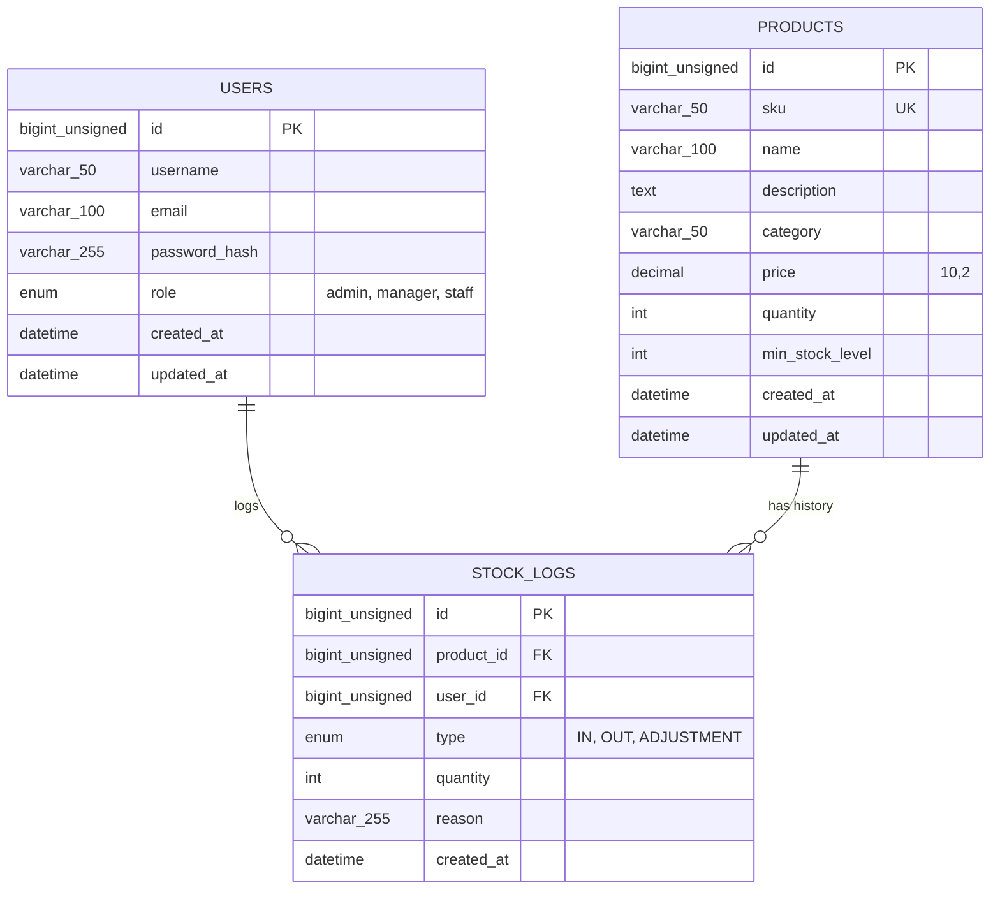

# Inventory System - Database Schema & ERD Design

**Database Engine:** MySQL 8.0+ / MariaDB 10.5+  
**Storage Engine:** InnoDB  
**Default Charset:** `utf8mb4`  
**Default Collation:** `utf8mb4_unicode_ci`

---

## 1. Entity Relationship Diagram (ERD)



---

## 2. Table Specifications

### 2.1 `users` Table
Stores authentication and role-based access information.

| Column | Type | Constraints | Description |
|---|---|---|---|
| `id` | `BIGINT UNSIGNED` | `PRIMARY KEY`, `AUTO_INCREMENT` | Unique user identifier |
| `username` | `VARCHAR(50)` | `NOT NULL`, `UNIQUE` | Unique username |
| `email` | `VARCHAR(100)` | `NOT NULL`, `UNIQUE` | User email address |
| `password_hash` | `VARCHAR(255)` | `NOT NULL` | Bcrypt hashed password |
| `role` | `ENUM('admin', 'manager', 'staff')` | `NOT NULL DEFAULT 'staff'` | User authorization role |
| `created_at` | `DATETIME` | `NOT NULL DEFAULT CURRENT_TIMESTAMP` | Record creation timestamp |
| `updated_at` | `DATETIME` | `NOT NULL DEFAULT CURRENT_TIMESTAMP ON UPDATE CURRENT_TIMESTAMP` | Last updated timestamp |

---

### 2.2 `products` Table
Stores product details and inventory quantity tracking.

| Column | Type | Constraints | Description |
|---|---|---|---|
| `id` | `BIGINT UNSIGNED` | `PRIMARY KEY`, `AUTO_INCREMENT` | Unique product identifier |
| `sku` | `VARCHAR(50)` | `NOT NULL`, `UNIQUE` | Stock Keeping Unit (e.g. `PROD-001`) |
| `name` | `VARCHAR(100)` | `NOT NULL` | Product name |
| `description` | `TEXT` | `NULL` | Product description |
| `category` | `VARCHAR(50)` | `NOT NULL DEFAULT 'General'` | Product category |
| `price` | `DECIMAL(10,2)` | `NOT NULL` | Product unit price |
| `quantity` | `INT` | `NOT NULL DEFAULT 0` | Current available stock quantity |
| `min_stock_level` | `INT` | `NOT NULL DEFAULT 5` | Low stock alert threshold |
| `created_at` | `DATETIME` | `NOT NULL DEFAULT CURRENT_TIMESTAMP` | Record creation timestamp |
| `updated_at` | `DATETIME` | `NOT NULL DEFAULT CURRENT_TIMESTAMP ON UPDATE CURRENT_TIMESTAMP` | Last updated timestamp |

---

### 2.3 `stock_logs` Table
Audit trail log of all inventory adjustments (Stock IN, Stock OUT, and manual adjustments).

| Column | Type | Constraints | Description |
|---|---|---|---|
| `id` | `BIGINT UNSIGNED` | `PRIMARY KEY`, `AUTO_INCREMENT` | Unique movement log identifier |
| `product_id` | `BIGINT UNSIGNED` | `NOT NULL`, `FK -> products(id)` | Associated product |
| `user_id` | `BIGINT UNSIGNED` | `NOT NULL`, `FK -> users(id)` | User who recorded movement |
| `type` | `ENUM('IN', 'OUT', 'ADJUSTMENT')` | `NOT NULL` | Type of inventory movement |
| `quantity` | `INT` | `NOT NULL` | Quantity changed (positive value) |
| `reason` | `VARCHAR(255)` | `NULL` | Reason or PO/Order reference |
| `created_at` | `DATETIME` | `NOT NULL DEFAULT CURRENT_TIMESTAMP` | Timestamp of movement |

---

## 3. SQL DDL Migration Script (`schema.sql`)

```sql
-- Database Initialization Script for Inventory System

CREATE DATABASE IF NOT EXISTS inventory_db
  DEFAULT CHARACTER SET utf8mb4
  DEFAULT COLLATE utf8mb4_unicode_ci;

USE inventory_db;

-- 1. Users Table
CREATE TABLE IF NOT EXISTS users (
    id BIGINT UNSIGNED NOT NULL AUTO_INCREMENT,
    username VARCHAR(50) NOT NULL,
    email VARCHAR(100) NOT NULL,
    password_hash VARCHAR(255) NOT NULL,
    role ENUM('admin', 'manager', 'staff') NOT NULL DEFAULT 'staff',
    created_at DATETIME NOT NULL DEFAULT CURRENT_TIMESTAMP,
    updated_at DATETIME NOT NULL DEFAULT CURRENT_TIMESTAMP ON UPDATE CURRENT_TIMESTAMP,
    PRIMARY KEY (id),
    UNIQUE KEY uk_users_username (username),
    UNIQUE KEY uk_users_email (email)
) ENGINE=InnoDB DEFAULT CHARSET=utf8mb4 COLLATE=utf8mb4_unicode_ci;

-- 2. Products Table
CREATE TABLE IF NOT EXISTS products (
    id BIGINT UNSIGNED NOT NULL AUTO_INCREMENT,
    sku VARCHAR(50) NOT NULL,
    name VARCHAR(100) NOT NULL,
    description TEXT NULL,
    category VARCHAR(50) NOT NULL DEFAULT 'General',
    price DECIMAL(10, 2) NOT NULL,
    quantity INT NOT NULL DEFAULT 0,
    min_stock_level INT NOT NULL DEFAULT 5,
    created_at DATETIME NOT NULL DEFAULT CURRENT_TIMESTAMP,
    updated_at DATETIME NOT NULL DEFAULT CURRENT_TIMESTAMP ON UPDATE CURRENT_TIMESTAMP,
    PRIMARY KEY (id),
    UNIQUE KEY uk_products_sku (sku),
    KEY idx_products_category (category),
    KEY idx_products_created_at (created_at DESC)
) ENGINE=InnoDB DEFAULT CHARSET=utf8mb4 COLLATE=utf8mb4_unicode_ci;

-- 3. Stock Logs Table
CREATE TABLE IF NOT EXISTS stock_logs (
    id BIGINT UNSIGNED NOT NULL AUTO_INCREMENT,
    product_id BIGINT UNSIGNED NOT NULL,
    user_id BIGINT UNSIGNED NOT NULL,
    type ENUM('IN', 'OUT', 'ADJUSTMENT') NOT NULL,
    quantity INT NOT NULL,
    reason VARCHAR(255) NULL,
    created_at DATETIME NOT NULL DEFAULT CURRENT_TIMESTAMP,
    PRIMARY KEY (id),
    KEY idx_stock_logs_product_created (product_id, created_at DESC),
    KEY idx_stock_logs_user (user_id),
    CONSTRAINT fk_stock_logs_product
        FOREIGN KEY (product_id) REFERENCES products(id)
        ON DELETE RESTRICT ON UPDATE CASCADE,
    CONSTRAINT fk_stock_logs_user
        FOREIGN KEY (user_id) REFERENCES users(id)
        ON DELETE RESTRICT ON UPDATE CASCADE
) ENGINE=InnoDB DEFAULT CHARSET=utf8mb4 COLLATE=utf8mb4_unicode_ci;
```
